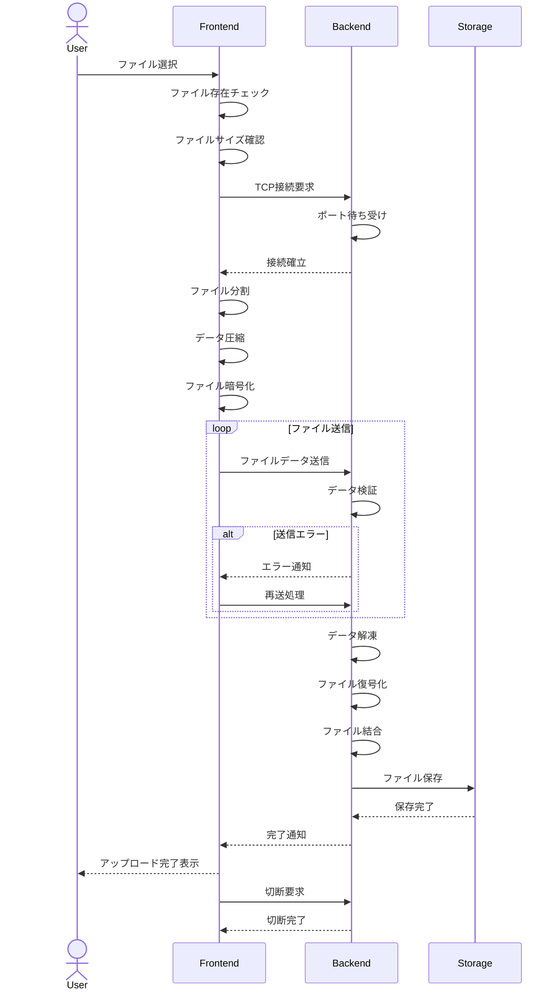

## 概要

```python
# server.pyでサーバーを起動
python3 stage2/server.py

# client.pyでクライアントを起動
# 配置しているファイルがアップロード、変換される
python3 stage2/client.py
```

## TODO

- [ ] 解像度とか command line arg で指定できるようにする
- [ ] 音声のメタデータがない場合のハンドリング
- [ ] 動画の受け取りをより実践的に

## シーケンス


